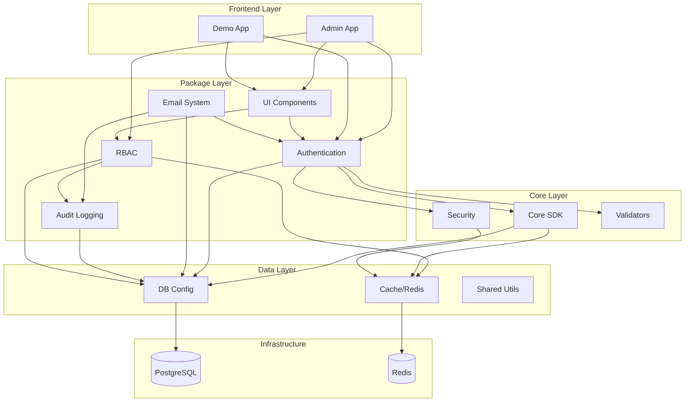
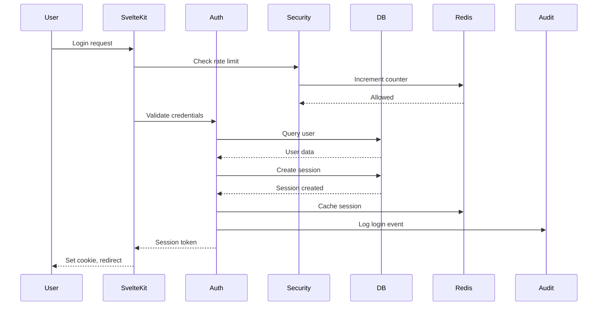
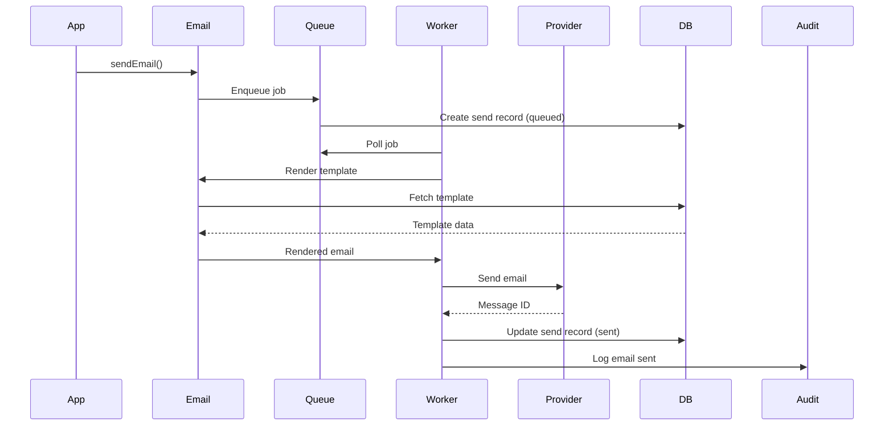

# SV-SDK Architecture

Comprehensive architecture documentation for the Svelte 5 SDK platform.

## System Overview

SV-SDK is a production-ready, modular SDK platform built with Svelte 5, featuring authentication, permissions, audit logging, email management, and more.

### Architecture Diagram



---

## Technology Stack

### Frontend
- **Svelte 5** - Reactive UI framework with runes
- **SvelteKit** - Full-stack framework
- **Tailwind CSS** - Utility-first CSS

### Backend
- **BetterAuth** - Authentication system
- **Drizzle ORM** - Type-safe database access
- **PostgreSQL** - Primary database
- **Redis** - Caching and sessions
- **BullMQ** - Queue system

### Development
- **TypeScript** - Type safety
- **pnpm** - Package manager
- **Turborepo** - Monorepo build system
- **Vitest** - Testing framework

---

## Package Architecture

### Layer 0: Foundation
- `@sv-sdk/shared` - Errors, logging, types, constants

### Layer 1: Data
- `@sv-sdk/db-config` - Database schemas and client
- `@sv-sdk/cache` - Redis caching and queues

### Layer 2: Validation & Core
- `@sv-sdk/validators` - Input validation and DTOs
- `@sv-sdk/core` - SDK core and plugin system
- `@sv-sdk/security` - Security utilities

### Layer 3: Features
- `@sv-sdk/auth` - Authentication
- `@sv-sdk/audit` - Audit logging
- `@sv-sdk/permissions` - RBAC system

### Layer 4: Advanced
- `@sv-sdk/email` - Email system

### Layer 5: UI
- `@sv-sdk/ui` - Component library

### Layer 6: Tools
- `@sv-sdk/cli` - Command-line tools
- `@sv-sdk/observability` - Monitoring

---

## Database Architecture

Single PostgreSQL database with 4 logical schemas:

```
sv_sdk (Database)
├── auth (Schema)
│   ├── users
│   ├── sessions
│   ├── accounts
│   └── verifications
├── email (Schema)
│   ├── email_templates
│   ├── email_sends
│   ├── email_webhooks
│   └── email_preferences
├── audit (Schema)
│   └── audit_logs
└── permissions (Schema)
    ├── roles
    ├── user_roles
    └── permission_cache
```

**Rationale**: See [DATABASE_DECISION.md](./DATABASE_DECISION.md)

---

## Data Flow

### User Authentication Flow



### Email Sending Flow



---

## Security Architecture

### Defense in Depth

1. **Input Layer**
   - Validation (Zod schemas)
   - Sanitization (XSS prevention)
   - Rate limiting

2. **Authentication Layer**
   - Password hashing (Argon2)
   - Session management
   - CSRF protection

3. **Authorization Layer**
   - RBAC permissions
   - Resource-level access control
   - Permission caching

4. **Data Layer**
   - SQL injection prevention (ORM)
   - Encryption at rest (for sensitive fields)
   - PII masking in logs

5. **Transport Layer**
   - HTTPS enforced (production)
   - Security headers (CSP, HSTS)
   - CORS configuration

---

## Plugin System

The core SDK supports a plugin architecture for modularity:

```typescript
const sdk = await createSDK({
  config: { name: 'my-app', version: '1.0.0' },
  plugins: [
    authPlugin,
    emailPlugin,
    auditPlugin,
  ],
})
```

### Plugin Lifecycle

1. **Validation** - Check plugin structure
2. **Dependency Resolution** - Sort by dependencies
3. **beforeInit** - Pre-initialization
4. **init** - Main initialization
5. **afterInit** - Post-initialization
6. **onDestroy** - Cleanup

---

## Caching Strategy

### Redis Cache Layers

1. **Session Cache** (TTL: 5 minutes)
   - User sessions
   - Quick lookup for authentication

2. **Permission Cache** (TTL: 5 minutes)
   - User permissions
   - Invalidated on role changes

3. **User Cache** (TTL: 5 minutes)
   - User profile data
   - Invalidated on updates

4. **Template Cache** (TTL: 1 hour)
   - Email templates
   - Rarely changes

### Cache Invalidation

- **Write-through**: Update DB → Invalidate cache
- **Lazy loading**: Cache miss → Query DB → Update cache
- **TTL-based**: Automatic expiry

---

## Deployment Architecture

### Development

```
Developer → Local SvelteKit → PostgreSQL (Docker) → Redis (Docker)
```

### Production

```
Users → CDN → Load Balancer → SvelteKit Instances
                                    ↓
                              PostgreSQL (RDS)
                              Redis (ElastiCache)
                              BullMQ Workers
```

---

## Scalability Considerations

### Horizontal Scaling

- **SvelteKit Apps**: Stateless, can scale horizontally
- **Queue Workers**: Scale based on queue depth
- **Database**: Read replicas for read-heavy workloads

### Vertical Scaling

- **Database**: Increase instance size for write-heavy workloads
- **Redis**: Increase memory for cache hit rate

### Performance Targets

- API latency: < 100ms (p95)
- Database queries: < 50ms (p95)
- Cache hits: > 80%
- Email queue: > 100 emails/second

---

## Monitoring & Observability

### Health Checks

- `/health/live` - Liveness probe
- `/health/ready` - Readiness probe
- `/health/startup` - Startup probe

### Metrics

- Request latency
- Error rates
- Queue depth
- Cache hit/miss ratio
- Database pool stats

### Logging

- Structured logging (JSON)
- Correlation IDs
- PII redaction
- Log levels (debug, info, warn, error)

---

## Security Model

### Authentication

- Argon2 password hashing
- Secure session tokens
- HttpOnly, Secure cookies
- CSRF protection

### Authorization

- Role-based access control (RBAC)
- Resource-level permissions
- Permission caching
- Audit logging

### Data Protection

- Input validation
- Output sanitization
- SQL injection prevention (ORM)
- XSS prevention
- PII masking

---

## References

- [Implementation Plan](./IMPLEMENTATION_PLAN.md)
- [Database Decision](./DATABASE_DECISION.md)
- [Development Workflow](./DEVELOPMENT_WORKFLOW.md)
- [Phase Dependencies](./PHASE_DEPENDENCIES.md)

