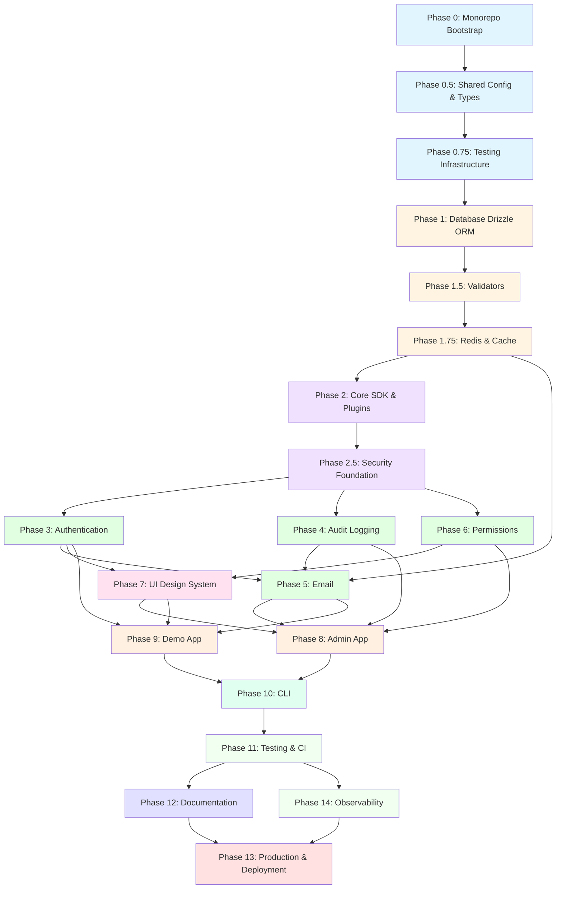

# Phase Dependencies & Implementation Order

This document visualizes the dependencies between implementation phases and helps you understand which phases can be worked on in parallel versus sequentially.

---

## Visual Dependency Graph



---

## Implementation Levels

Phases organized by dependency level (can work on same level in parallel):

### Level 0: Foundation (Sequential)

**Must be done first, in order**

1. **Phase 0**: Monorepo Bootstrap
   - Setup Turborepo, pnpm workspaces
   - Docker compose for services
   - Environment configuration

2. **Phase 0.5**: Shared Configuration & Types
   - Error classes
   - Logging utilities
   - Common types

3. **Phase 0.75**: Testing Infrastructure
   - Vitest configuration
   - Test database utilities
   - Mock factories

**Timeline**: 1-2 days  
**Blocker**: Nothing - start here  
**Output**: Working monorepo with dev environment

---

### Level 1: Data Layer (Sequential)

**Build the data foundation**

4. **Phase 1**: Database Configuration (Drizzle ORM)
   - Database schemas (auth, email, audit, permissions)
   - Migration system
   - Seed scripts
   - Zod schema generation

5. **Phase 1.5**: Type Safety & Validation Layer
   - DTO schemas extending Drizzle types
   - Validation utilities
   - API response types

6. **Phase 1.75**: Redis & Cache Configuration
   - Redis client setup
   - Cache utilities
   - BullMQ queue factory
   - Health checks

**Timeline**: 2-3 days  
**Blocker**: Level 0 complete  
**Output**: Database + Cache ready for use

---

### Level 2: Core Infrastructure (Sequential)

**Build the SDK core**

7. **Phase 2**: Core SDK & Plugin System
   - SDK context
   - Plugin system
   - Event bus
   - Health checks

8. **Phase 2.5**: Security Foundation
   - Rate limiting (needs Redis from 1.75)
   - CSRF protection
   - Input sanitization
   - Security headers

**Timeline**: 2-3 days  
**Blocker**: Level 1 complete  
**Output**: SDK core + security utilities ready

---

### Level 3: Domain Features (PARALLEL - can work on simultaneously)

**Core business logic packages**

9. **Phase 3**: Authentication Package
   - BetterAuth integration
   - User CRUD
   - Session management
   - Password policies
   - **Dependencies**: 0.5, 1, 1.75, 2.5

10. **Phase 4**: Audit Logging Package
    - Log writing/reading
    - PII masking
    - Retention policies
    - **Dependencies**: 0.5, 1, 2.5

11. **Phase 6**: Permissions Package
    - RBAC implementation
    - Permission caching
    - Role management
    - **Dependencies**: 0.5, 1, 1.75, 2.5

**Timeline**: 3-5 days (parallel work possible)  
**Blocker**: Level 2 complete  
**Output**: Auth, Audit, Permissions packages ready

**Parallel Strategy**:

- Developer A: Phase 3 (Authentication)
- Developer B: Phase 4 (Audit)
- Developer C: Phase 6 (Permissions)

---

### Level 4: Email System (Sequential)

**Depends on auth and audit**

12. **Phase 5**: Email Package (Templates + Queue + Providers)
    - Provider abstraction (Brevo, SES, Mock)
    - MJML templates
    - Queue integration
    - Webhook handling
    - **Dependencies**: 1, 1.75, 3, 4

**Timeline**: 3-4 days  
**Blocker**: Phases 3, 4 complete (needs auth for verification emails, audit for logging)  
**Output**: Email system ready

---

### Level 5: User Interface (Sequential)

**Build UI components**

13. **Phase 7**: UI Design System Package
    - Tailwind configuration
    - Design tokens
    - Svelte 5 components
    - Accessibility implementation
    - **Dependencies**: 0.5, 3, 6

**Timeline**: 4-5 days  
**Blocker**: Phases 3, 6 complete (needs auth/permissions for protected components)  
**Output**: UI component library ready

---

### Level 6: Applications (PARALLEL - can work on simultaneously)

**User-facing applications**

14. **Phase 8**: Admin App
    - Admin routes (dashboard, users, roles, audit, templates, emails)
    - API endpoints with versioning
    - Real-time features
    - **Dependencies**: 3, 4, 5, 6, 7

15. **Phase 9**: Demo App
    - Public pages
    - Authentication flows
    - User profile
    - **Dependencies**: 3, 5, 7

**Timeline**: 5-7 days (parallel work possible)  
**Blocker**: Level 5 complete  
**Output**: Both apps functional

**Parallel Strategy**:

- Team A: Phase 8 (Admin App)
- Team B: Phase 9 (Demo App)

---

### Level 7: Developer Tools (Sequential)

**CLI and tooling**

16. **Phase 10**: CLI Package
    - Auth commands
    - Audit commands
    - Email commands
    - Database commands
    - **Dependencies**: All previous feature packages

**Timeline**: 2-3 days  
**Blocker**: Phases 8, 9 complete  
**Output**: CLI tool ready

---

### Level 8: Quality & Infrastructure (PARALLEL)

**Testing, monitoring, docs**

17. **Phase 11**: Comprehensive Testing & CI
    - Test suites for all packages
    - CI/CD workflows
    - Code quality tools
    - **Dependencies**: 10

18. **Phase 14**: Observability & Monitoring
    - Metrics collection
    - Error tracking
    - Health checks
    - **Dependencies**: 10

19. **Phase 12**: Documentation
    - Architecture docs
    - API reference
    - Package READMEs
    - **Dependencies**: 11

**Timeline**: 3-4 days (parallel work possible)  
**Blocker**: Phase 10 complete  
**Output**: Complete test suite, monitoring, documentation

**Parallel Strategy**:

- QA Team: Phase 11 (Testing)
- DevOps: Phase 14 (Observability)
- Tech Writer: Phase 12 (Docs)

---

### Level 9: Production Ready (Sequential)

**Final deployment preparation**

20. **Phase 13**: Production Readiness & Deployment
    - Infrastructure as code
    - Deployment guides
    - Production checklists
    - **Dependencies**: 11, 12, 14

**Timeline**: 2-3 days  
**Blocker**: Phases 11, 12, 14 complete  
**Output**: Production-ready system

---

## Critical Path

The **critical path** (longest sequential dependency chain):

```
P0 → P0.5 → P0.75 → P1 → P1.5 → P1.75 → P2 → P2.5 → P3 → P5 → P7 → P8 → P10 → P11 → P12 → P13
```

**Total Critical Path Duration**: ~28-38 days (sequential)

---

## Optimized Timeline with Parallel Work

### Week 1: Foundation (Days 1-3)

- **Day 1**: Phase 0 (Monorepo Bootstrap)
- **Day 2**: Phase 0.5 (Shared Config) + Phase 0.75 (Testing Infrastructure)
- **Day 3**: Phase 1 (Database Configuration)

### Week 2: Core Infrastructure (Days 4-7)

- **Day 4**: Phase 1.5 (Validators)
- **Day 5**: Phase 1.75 (Redis & Cache)
- **Day 6**: Phase 2 (Core SDK & Plugins)
- **Day 7**: Phase 2.5 (Security Foundation)

### Week 3: Domain Features - Parallel (Days 8-12)

- **Days 8-12**:
  - Dev A: Phase 3 (Authentication)
  - Dev B: Phase 4 (Audit Logging)
  - Dev C: Phase 6 (Permissions)

### Week 4: Email + UI (Days 13-19)

- **Days 13-16**: Phase 5 (Email Package)
- **Days 17-19**: Phase 7 (UI Design System)

### Week 5: Applications - Parallel (Days 20-26)

- **Days 20-26**:
  - Team A: Phase 8 (Admin App)
  - Team B: Phase 9 (Demo App)

### Week 6: Tools & Quality (Days 27-32)

- **Days 27-29**: Phase 10 (CLI)
- **Days 30-32**:
  - QA Team: Phase 11 (Testing & CI)
  - DevOps: Phase 14 (Observability)
  - Tech Writer: Phase 12 (Documentation)

### Week 7: Production (Days 33-35)

- **Days 33-35**: Phase 13 (Production Readiness & Deployment)

**Total Optimized Duration**: ~35 days (5 weeks) with 3-person team

---

## Package-Level Dependencies

### Package Import Graph

```
Level 0 (No dependencies):
- @sv-sdk/shared

Level 1 (Depends on Level 0):
- @sv-sdk/db-config
- @sv-sdk/cache

Level 2 (Depends on Level 0-1):
- @sv-sdk/validators (depends on db-config)
- @sv-sdk/core (depends on shared, db-config, cache)
- @sv-sdk/security (depends on shared, cache)

Level 3 (Depends on Level 0-2):
- @sv-sdk/auth (depends on db-config, validators, cache, security, core)
- @sv-sdk/audit (depends on db-config, shared, core)
- @sv-sdk/permissions (depends on db-config, cache, audit)

Level 4 (Depends on Level 0-3):
- @sv-sdk/email (depends on db-config, cache, auth, audit)

Level 5 (Depends on Level 0-4):
- @sv-sdk/ui (depends on auth, permissions)

Level 6 (Applications):
- apps/admin (depends on all packages)
- apps/demo-app (depends on auth, email, ui, permissions)

Level 7 (Tools):
- @sv-sdk/cli (depends on all feature packages)
- @sv-sdk/observability (depends on core, cache)
```

---

## Blockers & Prerequisites

### Phase 3 (Authentication)

**Cannot start until**:

- ✅ Phase 1 complete (needs database schemas)
- ✅ Phase 1.75 complete (needs Redis for session caching)
- ✅ Phase 2.5 complete (needs rate limiting)

**Blocks**:

- ❌ Phase 5 (Email needs auth for verification emails)
- ❌ Phase 7 (UI needs auth for protected components)
- ❌ Phase 8 (Admin needs auth for login)
- ❌ Phase 9 (Demo needs auth flows)

### Phase 5 (Email)

**Cannot start until**:

- ✅ Phase 3 complete (auth verification emails)
- ✅ Phase 4 complete (audit logging for email sends)
- ✅ Phase 1.75 complete (BullMQ queue)

**Blocks**:

- ❌ Phase 8 (Admin email template management)
- ❌ Phase 9 (Demo send verification email)

### Phase 7 (UI)

**Cannot start until**:

- ✅ Phase 3 complete (auth components)
- ✅ Phase 6 complete (permission-based rendering)

**Blocks**:

- ❌ Phase 8 (Admin uses UI components)
- ❌ Phase 9 (Demo uses UI components)

### Phase 8 & 9 (Applications)

**Cannot start until**:

- ✅ All feature packages complete (3, 4, 5, 6, 7)

**Blocks**:

- ❌ Phase 10 (CLI needs working apps to test against)

---

## Parallel Work Opportunities

### Scenario 1: Solo Developer

**Follow Critical Path**: Implement phases 0 → 13 sequentially  
**Duration**: ~38 days

### Scenario 2: 2-Person Team

**Week 3 Parallelization**:

- Dev 1: Phase 3 (Auth) → Phase 5 (Email) → Phase 8 (Admin)
- Dev 2: Phase 4 (Audit) + Phase 6 (Permissions) → Phase 7 (UI) → Phase 9 (Demo)

**Duration**: ~30 days

### Scenario 3: 3-Person Team (Optimal)

**Week 3 Parallelization**:

- Dev 1: Phase 3 (Auth)
- Dev 2: Phase 4 (Audit)
- Dev 3: Phase 6 (Permissions)

**Week 5 Parallelization**:

- Team A (2 devs): Phase 8 (Admin)
- Team B (1 dev): Phase 9 (Demo)

**Week 6 Parallelization**:

- QA: Phase 11 (Testing)
- DevOps: Phase 14 (Observability)
- Tech Writer: Phase 12 (Documentation)

**Duration**: ~28 days

### Scenario 4: 4+ Person Team

**Diminishing Returns**: More parallelization possible but coordination overhead increases.

**Best approach**:

- Core team (3 devs) on critical path
- Additional devs on:
  - Writing comprehensive tests as features complete
  - Documentation as features complete
  - Observability/monitoring setup

**Duration**: ~25 days

---

## Risk Mitigation

### High-Risk Dependencies

1. **Phase 1 → Everything**
   - Database schema changes ripple through all packages
   - **Mitigation**: Finalize schema design before starting other phases
   - **Recovery**: Schema changes require coordinated updates across packages

2. **Phase 3 (Auth) → Phase 5, 7, 8, 9**
   - Authentication is central to most features
   - **Mitigation**: Complete auth thoroughly before moving forward
   - **Recovery**: Auth bugs require fixes across multiple apps

3. **Phase 7 (UI) → Phase 8, 9**
   - UI component changes affect both apps
   - **Mitigation**: Use Storybook to test components in isolation
   - **Recovery**: Component API changes require app updates

### Integration Points

**Critical integrations to test early**:

1. **Auth + Email** (Phase 3 + 5):
   - Verification email sending
   - Password reset emails

2. **Auth + Permissions** (Phase 3 + 6):
   - Role assignment on user creation
   - Permission checks

3. **Auth + Audit** (Phase 3 + 4):
   - Login/logout logging
   - Failed auth attempts

4. **Email + Queue** (Phase 5 + 1.75):
   - BullMQ job processing
   - Retry logic

**Test integration immediately after both phases complete.**

---

## Decision Points

### At Phase 1 Completion

**Decision**: Finalize database schema design  
**Why**: Schema changes are expensive after other packages depend on it  
**Review**: All entity relationships, indexes, constraints

### At Phase 7 Completion

**Decision**: Finalize UI component API  
**Why**: Both apps (Phase 8, 9) will depend on component interfaces  
**Review**: Component props, events, slots

### At Phase 11 Completion

**Decision**: Production readiness assessment  
**Why**: Determines if Phase 13 proceeds or more work needed  
**Review**: Test coverage, security audit, performance benchmarks

---

## Summary

- **Fastest Sequential**: 28 days (skilled solo dev)
- **Fastest Parallel**: 25 days (3-4 person team)
- **Critical Path**: P0 → P0.5 → P0.75 → P1 → P1.5 → P1.75 → P2 → P2.5 → P3 → P5 → P7 → P8 → P10 → P11 → P12 → P13
- **Key Parallelization Points**: Week 3 (Features), Week 5 (Apps), Week 6 (Quality)
- **Highest Risk**: Phase 1 (Database) - get it right first time

---

## Next Steps

1. **Review this dependency graph** with your team
2. **Assign developers** to parallel phases
3. **Set up project board** with phase cards
4. **Start with Phase 0** - monorepo bootstrap
5. **Check off phases** as they complete in IMPLEMENTATION_PLAN.md

---

**See Also**:

- [IMPLEMENTATION_PLAN.md](./IMPLEMENTATION_PLAN.md) - Detailed phase instructions
- [DEVELOPMENT_WORKFLOW.md](./DEVELOPMENT_WORKFLOW.md) - Daily development guide
- [DATABASE_DECISION.md](./DATABASE_DECISION.md) - Database architecture rationale
