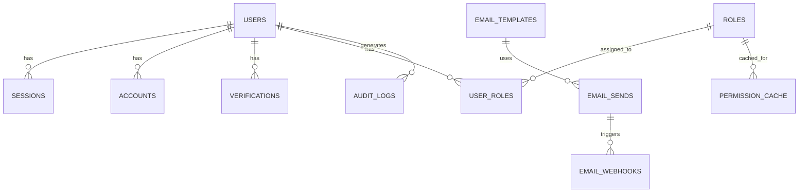
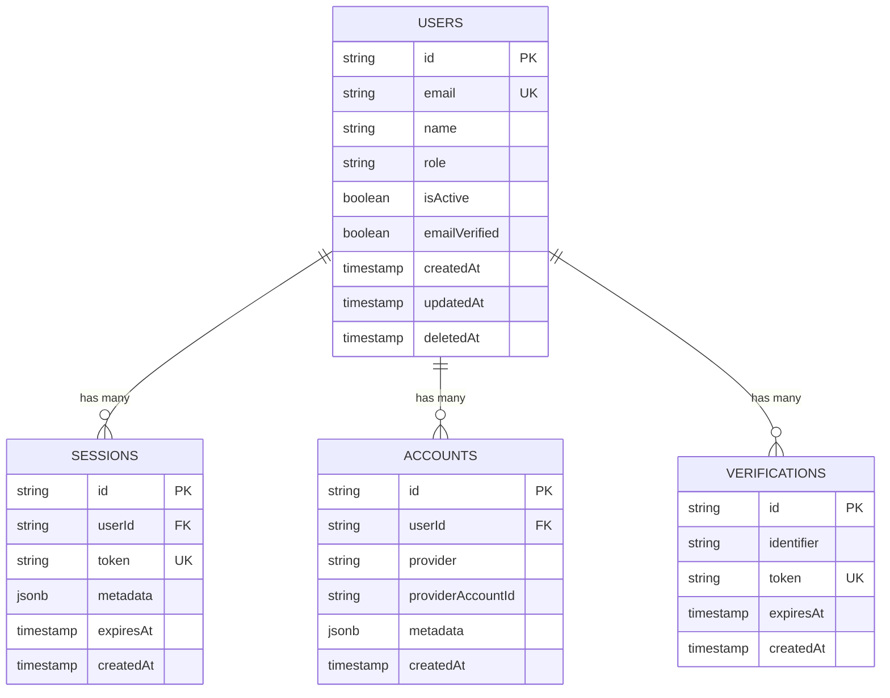
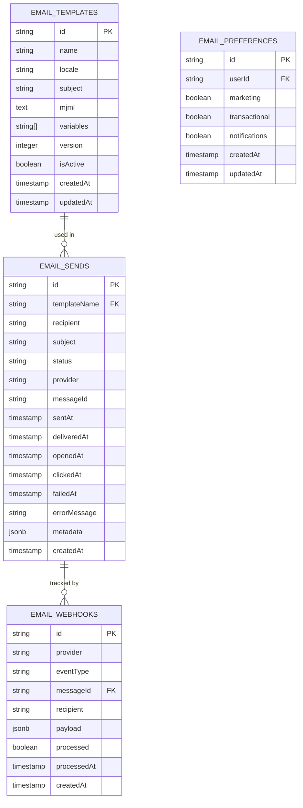
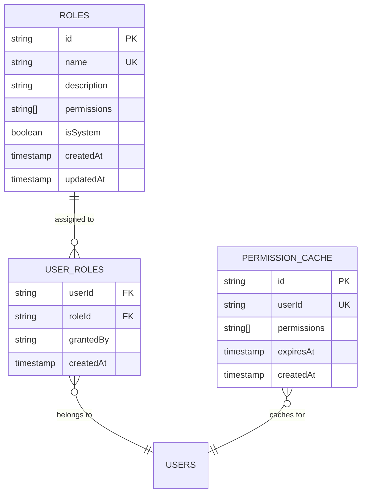
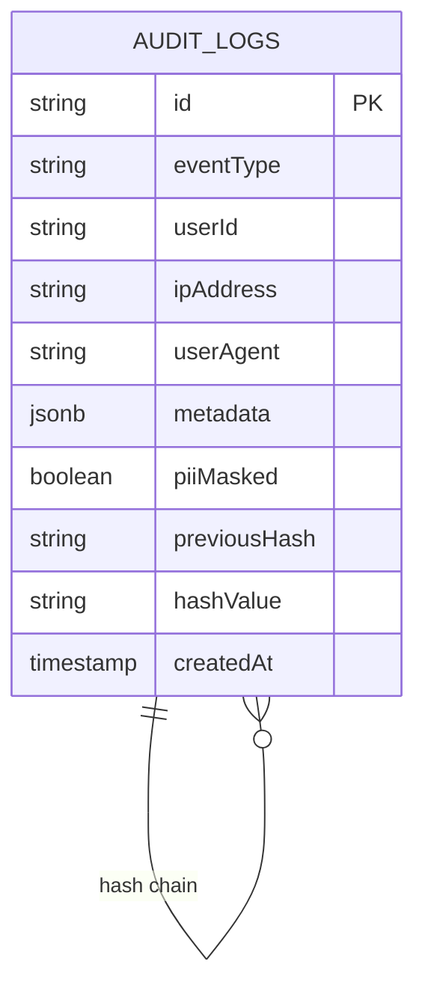

# Database Schema Diagrams

Visual representation of all database schemas in SV-SDK.

---

## Schema Overview



---

## Auth Schema



---

## Email Schema



---

## Permissions Schema



---

## Audit Schema



---

## Indexes

### Auth Schema

```sql
-- Users
CREATE INDEX idx_users_email ON auth.users(email);
CREATE INDEX idx_users_role ON auth.users(role);
CREATE INDEX idx_users_deleted_at ON auth.users(deletedAt) WHERE deletedAt IS NOT NULL;

-- Sessions
CREATE INDEX idx_sessions_user_id ON auth.sessions(userId);
CREATE INDEX idx_sessions_token ON auth.sessions(token);
CREATE INDEX idx_sessions_expires_at ON auth.sessions(expiresAt);
```

### Email Schema

```sql
-- Email Sends
CREATE INDEX idx_email_sends_recipient ON email.email_sends(recipient);
CREATE INDEX idx_email_sends_status ON email.email_sends(status);
CREATE INDEX idx_email_sends_created_at ON email.email_sends(createdAt DESC);
CREATE INDEX idx_email_sends_message_id ON email.email_sends(messageId);

-- Email Templates
CREATE INDEX idx_email_templates_name_locale ON email.email_templates(name, locale);
CREATE INDEX idx_email_templates_active ON email.email_templates(isActive) WHERE isActive = true;
```

### Audit Schema

```sql
-- Audit Logs
CREATE INDEX idx_audit_logs_user_id ON audit.audit_logs(userId);
CREATE INDEX idx_audit_logs_event_type ON audit.audit_logs(eventType);
CREATE INDEX idx_audit_logs_created_at ON audit.audit_logs(createdAt DESC);
CREATE INDEX idx_audit_logs_metadata ON audit.audit_logs USING GIN (metadata);
```

### Permissions Schema

```sql
-- Roles
CREATE UNIQUE INDEX idx_roles_name ON permissions.roles(name);

-- User Roles
CREATE INDEX idx_user_roles_user_id ON permissions.user_roles(userId);
CREATE INDEX idx_user_roles_role_id ON permissions.user_roles(roleId);

-- Permission Cache
CREATE UNIQUE INDEX idx_permission_cache_user_id ON permissions.permission_cache(userId);
CREATE INDEX idx_permission_cache_expires_at ON permissions.permission_cache(expiresAt);
```

---

## Table Sizes (Estimated)

| Table | Rows (1K users) | Rows (100K users) | Storage |
|-------|-----------------|-------------------|---------|
| users | 1,000 | 100,000 | 50MB |
| sessions | 2,000 | 200,000 | 100MB |
| audit_logs | 100,000 | 10M | 5GB |
| email_sends | 50,000 | 5M | 2GB |
| roles | 10 | 10 | 1MB |
| user_roles | 1,000 | 100,000 | 10MB |

---

## Partitioning Strategy

### Audit Logs (For > 10M rows)

```sql
-- Partition by month
CREATE TABLE audit.audit_logs_2024_01 PARTITION OF audit.audit_logs
FOR VALUES FROM ('2024-01-01') TO ('2024-02-01');

CREATE TABLE audit.audit_logs_2024_02 PARTITION OF audit.audit_logs
FOR VALUES FROM ('2024-02-01') TO ('2024-03-01');

-- Auto-create partitions with pg_partman extension
```

---

## Backup Strategy

### What to Backup

- **Critical**: auth schema (users, sessions)
- **Important**: permissions schema (roles, user_roles)
- **Archive**: audit logs (long-term retention)
- **Reproducible**: email_templates (also in git)

### Backup Schedule

- **Full backup**: Daily at 2 AM UTC
- **Incremental**: Every 6 hours
- **Retention**: 30 days
- **Off-site**: Copy to S3/GCS weekly

---

## Performance Tips

1. **Indexes**: Add for all foreign keys and WHERE clauses
2. **VACUUM**: Run weekly on large tables
3. **Partitioning**: For audit logs > 10M rows
4. **Archive Old Data**: Move old audit logs to cold storage
5. **Connection Pooling**: Use PgBouncer for > 100 connections
6. **Read Replicas**: For heavy read workloads

---

## Migration Strategy

See [migrations.md](../deployment/migrations.md) for detailed guide.

