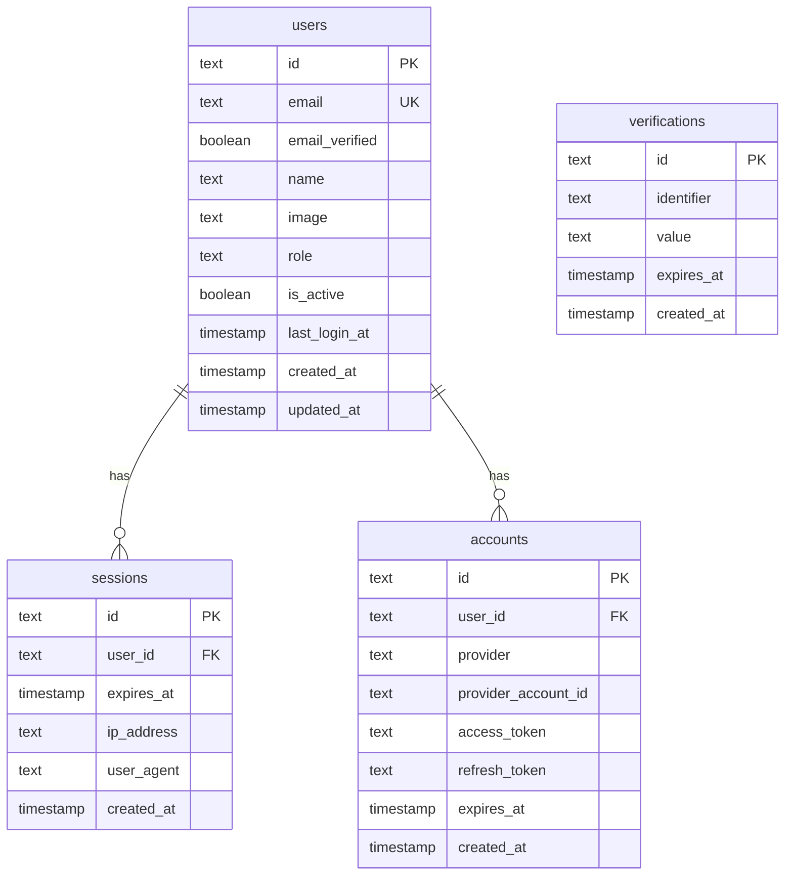
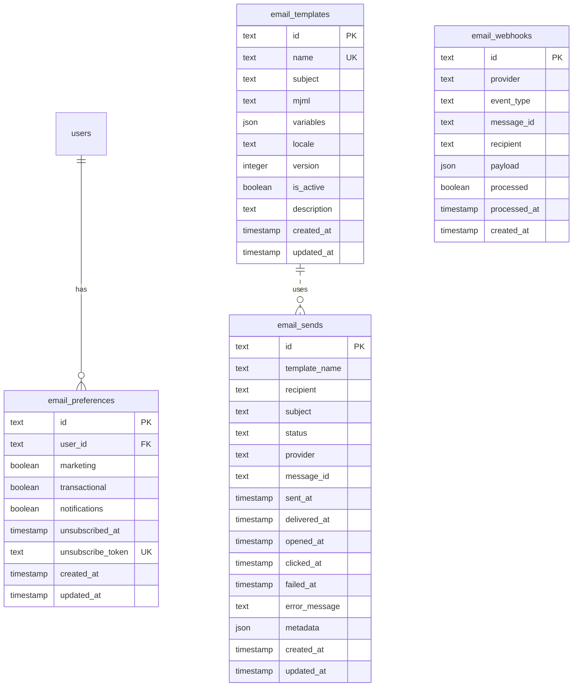
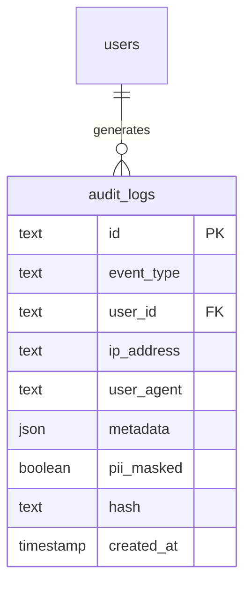

# Database Schema Documentation

This document provides visual documentation of the SV-SDK database schemas.

---

## Overview

The SV-SDK uses a single PostgreSQL database (`sv_sdk`) with 4 logical schemas:

1. **auth** - User authentication and session management
2. **email** - Email templates and sending history
3. **audit** - Audit logging for compliance
4. **permissions** - Role-based access control (RBAC)

---

## Auth Schema

### Entity Relationship Diagram



### Tables

#### users

- **Purpose**: Stores user account information
- **Indexes**: email (unique)
- **BetterAuth Required Fields**: id, email, emailVerified, name, image
- **Custom Fields**: role, isActive, lastLoginAt

#### sessions

- **Purpose**: Tracks active user sessions
- **Indexes**: userId, expiresAt
- **Cascade Delete**: When user is deleted

#### accounts

- **Purpose**: Links users to OAuth providers
- **Indexes**: userId
- **Cascade Delete**: When user is deleted

#### verifications

- **Purpose**: Stores verification tokens (email, password reset)
- **Indexes**: None (short-lived data)

---

## Email Schema

### Entity Relationship Diagram



### Tables

#### email_templates

- **Purpose**: Stores MJML email templates
- **Indexes**: name (unique)
- **Versioning**: Supports multiple versions of same template

#### email_sends

- **Purpose**: Tracks all email sending attempts
- **Indexes**: status, createdAt
- **Providers**: Brevo, AWS SES, Mock

#### email_webhooks

- **Purpose**: Stores webhook events from providers
- **Indexes**: processed
- **Events**: delivered, bounced, opened, clicked, complained

#### email_preferences

- **Purpose**: User email subscription preferences
- **Indexes**: userId, unsubscribeToken (unique)
- **Cascade Delete**: When user is deleted

---

## Audit Schema

### Entity Relationship Diagram



### Tables

#### audit_logs

- **Purpose**: Append-only audit trail
- **Indexes**:
  - eventType
  - userId
  - createdAt
  - eventType + createdAt (composite)
  - userId + createdAt (composite)
- **Integrity**: Cryptographic hash for tamper detection
- **PII**: Supports automatic PII masking

**Common Event Types**:

- `user.login`, `user.logout`
- `user.created`, `user.updated`, `user.deleted`
- `email.sent`, `email.failed`
- `permission.granted`, `permission.denied`

---

## Permissions Schema

### Entity Relationship Diagram

```mermaid
erDiagram
    users ||--o{ user_roles : has
    roles ||--o{ user_roles : assigned_to
    users ||--o| permission_cache : has

    roles {
        text id PK
        text name UK
        text description
        json permissions
        boolean is_system
        timestamp created_at
        timestamp updated_at
    }
    user_roles {
        text user_id FK "PK"
        text role_id FK "PK"
        timestamp granted_at
        text granted_by FK
    }
    permission_cache {
        text id PK
        text user_id FK UK
        json permissions
        timestamp expires_at
        timestamp created_at
    }
```

### Tables

#### roles

- **Purpose**: Defines roles in RBAC system
- **Indexes**: name (unique)
- **System Roles**: Cannot be deleted or modified (super_admin, admin, manager, user)
- **Permissions Format**: `action:scope:resource` (e.g., `read:any:user`)

#### user_roles

- **Purpose**: Many-to-many relationship between users and roles
- **Indexes**: userId, roleId
- **Composite Primary Key**: (userId, roleId)
- **Audit**: Tracks who granted the role and when

#### permission_cache

- **Purpose**: Caches flattened permissions for performance
- **Indexes**: userId (unique), expiresAt
- **TTL**: 5 minutes (configurable)
- **Invalidation**: On role assignment/revocation

---

## Indexing Strategy

### High-Traffic Tables

**audit_logs**:

- Most writes, append-only
- Indexes optimized for time-range queries
- Partitioning considered for high volume

**sessions**:

- Frequent reads and deletes
- Index on userId and expiresAt for cleanup

**email_sends**:

- High write volume
- Indexes on status and createdAt for monitoring

### Query Patterns

**Common Queries**:

1. Get user with roles: `JOIN users, user_roles, roles`
2. Check permissions: `SELECT from permission_cache WHERE userId = ?`
3. Audit trail: `SELECT from audit_logs WHERE userId = ? AND eventType = ? AND createdAt BETWEEN ? AND ?`
4. Email history: `SELECT from email_sends WHERE recipient = ? ORDER BY createdAt DESC`

---

## Data Retention

### audit_logs

- **Retention**: 365 days (configurable)
- **Archive**: Move to cold storage before deletion
- **Legal Hold**: Support for indefinite retention

### sessions

- **Cleanup**: Expired sessions deleted automatically
- **Frequency**: Daily cleanup job

### email_sends

- **Retention**: 90 days (configurable)
- **Archive**: Compressed JSON export

### verifications

- **Cleanup**: Expired tokens deleted automatically
- **Frequency**: Hourly cleanup job

---

## Performance Considerations

### Connection Pooling

- **Max Connections**: 20 (configurable via `DB_POOL_SIZE`)
- **Idle Timeout**: 20 seconds
- **Connect Timeout**: 10 seconds

### Query Optimization

- All foreign keys indexed
- Composite indexes for common queries
- EXPLAIN ANALYZE used for slow queries

### Monitoring

- Connection pool utilization
- Query execution times
- Index usage statistics

---

## Backup Strategy

### Frequency

- **Production**: Daily automated backups
- **Point-in-Time Recovery**: Enabled
- **Retention**: 30 days

### Verification

- Automated restore tests weekly
- Backup integrity checks

---

## Migration Best Practices

1. **Test Migrations**: Always test in development/staging first
2. **Rollback Plan**: Document rollback procedure
3. **Zero-Downtime**: Use backward-compatible changes
4. **Data Migration**: Separate schema and data migrations
5. **Version Control**: All migrations in git

---

## References

- [Drizzle ORM Documentation](https://orm.drizzle.team/)
- [PostgreSQL Schema Documentation](https://www.postgresql.org/docs/current/ddl-schemas.html)
- [BetterAuth Schema Requirements](https://www.better-auth.com/docs/concepts/database)
